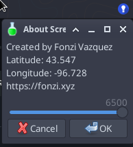

TL;DR
This script dynamically adjusts the screen temperature based on the current time, using sunrise and sunset times fetched from an API. It was created because redshift does not work on Debian with XFCE due to a bug that tries to pull in Wayland on an X11 desktop environment.

Instructions to Set Up and Run the Screen Temperature Adjustment Script on Debian with XFCE
Prerequisites
Install jq: A lightweight and flexible command-line JSON processor.


```
sudo apt-get update
sudo apt-get install jq
```
Install xsct: A tool to set the screen color temperature.

```sudo apt-get install xsct```
Install yad: Yet Another Dialog, a tool for creating graphical dialogs from shell scripts.

```sudo apt-get install yad```
Script Setup
Download the Script:
Save the following script as night_screen.sh:

Update the lat and long in the script. 

Make executable 
```chmod +x night_screen.sh```


Running the Script in the Background on XFCE
Add to Startup Applications:

Open Session and Startup from the XFCE settings menu.
Go to the Application Autostart tab.
Click on Add and enter the following details:
Name: Screen Temperature Adjuster
Description: Adjusts screen temperature based on time
Command: ```/path/to/night_screen.sh```
Replace ```/path/to/night_screen.sh``` with the actual path to the script.
Run the Script Manually:
If you want to run the script manually, open a terminal and execute:

```/path/to/night_screen.sh &```
This setup ensures that the screen temperature is dynamically adjusted based on the current time and the sunrise and sunset times for your location. The script will run in the background and update the screen temperature every hour.


Includes a menu tray icon and a slider to setup a custom screen resolution

